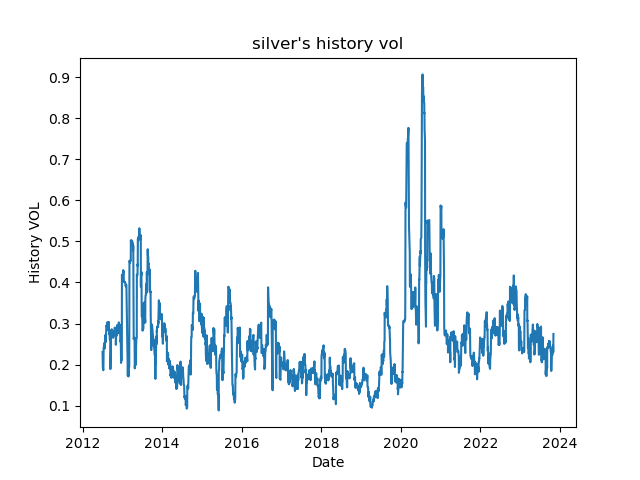
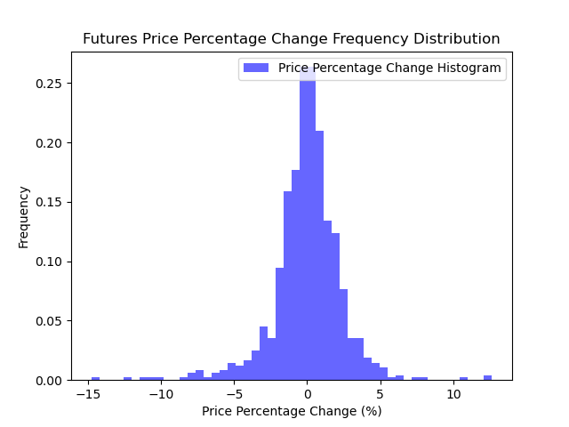
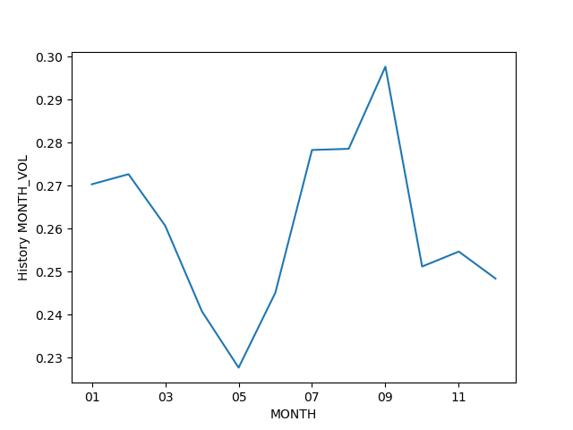
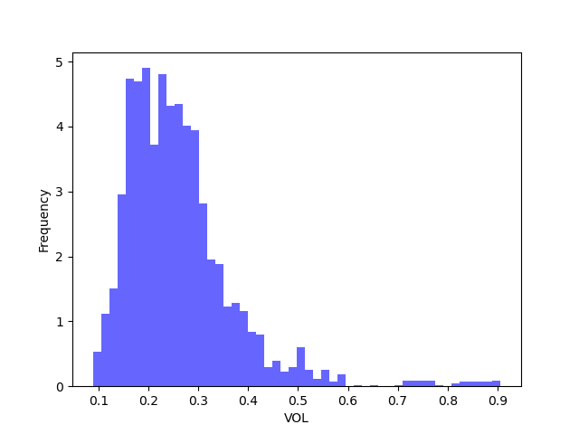

# Trading projects for quant

   

this project use some mathematical or financial models to help the trader know more about the
financial market.  such as the option black-sholes pricing model.A

And it use a lot of quant platform in CTP future trading and backtesting

### Baktest

use the backtrader to help the quant know how the backtest their strategy

### CTP

use the ctpbee and pyctp to write the strategy in CTP

### Data

some history data to help build your model or backtest your strategy

Denote the Author or if you have any problem please send message to 578352756@qq.com

